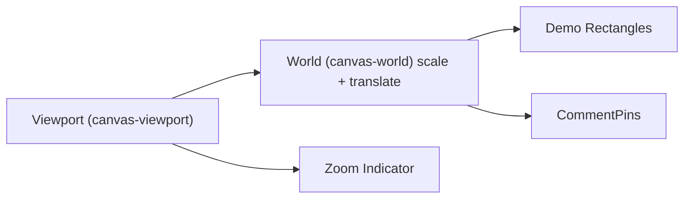
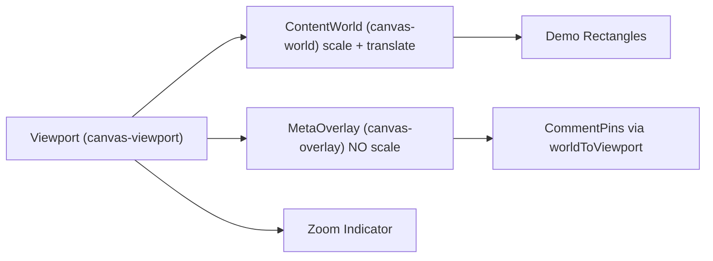

# Canvas Render Layers

## Current Architecture

The canvas renders everything inside a single `canvas-world` div that applies `scale(zoom) translate(...)`. This means both content rectangles and comment pins scale with zoom, making pins shrink/grow as the user zooms.



## Target Architecture

Split rendering into two sibling layers inside the viewport:



- **ContentWorld**: keeps existing `transform: scale(zoom) translate(...)`, renders only design/content elements
- **MetaOverlay**: `position: absolute; inset: 0; pointer-events: none`, no scale transform, renders pins using `worldToViewport()` positioning
- **Pins**: `pointer-events: auto` so they remain clickable within the `pointer-events: none` overlay

## Files Changed

### 1. Canvas.tsx (`src/features/canvas/components/Canvas.tsx`)

Move the `threads.map(...)` block out of `canvas-world` into a new overlay sibling:

```tsx
<div
  data-testid="canvas-world"
  className="absolute"
  style={{
    transformOrigin: "0 0",
    transform: `scale(${camera.zoom}) translate(${-camera.x}px, ${-camera.y}px)`,
  }}
>
  {/* demo rects only */}
</div>

<div
  data-testid="canvas-overlay"
  className="absolute inset-0 pointer-events-none"
>
  {threads.map((thread) => (
    <CommentPin key={thread.id} thread={thread} camera={camera} />
  ))}
</div>
```

### 2. CommentPin.tsx (`src/features/comments/components/CommentPin.tsx`)

- Add `camera: { x: number; y: number; zoom: number }` to `CommentPinProps` (inline type -- avoids importing from canvas feature, preserving one-way dependency direction)
- Compute viewport position inline: `const viewportX = (thread.x - camera.x) * camera.zoom` (and same for Y)
- Set `left: viewportX`, `top: viewportY` (instead of `thread.x`, `thread.y`)
- Add `pointer-events: auto` (via className) so pin remains clickable inside the `pointer-events: none` overlay
- Keep existing speech-bubble anchor: `transform: translate(0, -100%)`

### 3. CommentPin.test.tsx (`src/features/comments/__tests__/CommentPin.test.tsx`)

- Update test renders to pass a `camera` prop (e.g., `{ x: 0, y: 0, zoom: 1 }`)
- The position assertion (`left: '100px', top: '200px'`) remains valid because `worldToViewport(100, 200, {x:0, y:0, zoom:1})` returns `{x:100, y:200}`
- Add a test that verifies correct position when camera has non-1 zoom (e.g., `camera: {x:0, y:0, zoom:2}` should give `left: 200px, top: 400px`)
- Add a test that verifies correct position with panned camera (e.g., `camera: {x:50, y:100, zoom:1}` should give `left: 50px, top: 100px`)

### 4. Canvas.test.tsx (`src/features/canvas/__tests__/Canvas.test.tsx`)

- Add a smoke test for the new `canvas-overlay` div
- Existing tests remain valid (pins still render inside `canvas-viewport`, just in the overlay instead of world)

## What Did NOT Change

- Camera math and coordinate utilities (`cameraUtils.ts`) -- untouched
- Interaction logic (`useCanvasInteraction.ts`) -- untouched
- Data model / store (`useEditorStore.ts`) -- untouched
- Thread creation flow (click -> viewportToWorld -> addThreadAt) -- untouched
- SidePanel, ThreadPanel, ThreadList -- untouched

## Cross-Feature Dependency

Canvas imports from comments (store, components) -- this is the existing one-way dependency. CommentPin avoids importing from canvas by using an inline type for the camera prop and inlining the trivial `worldToViewport` math. This preserves the dev-docs principle that the dependency (comments) has no knowledge of the dependent feature (canvas).

## Todos

- [x] Refactor Canvas.tsx: move pins out of canvas-world into a new MetaOverlay sibling div (canvas-overlay), pass camera prop to CommentPin
- [x] Update CommentPin.tsx: accept camera prop, use worldToViewport() for positioning, add pointer-events: auto
- [x] Update CommentPin.test.tsx: pass camera prop, add zoom-aware position test
- [x] Update Canvas.test.tsx: add smoke test for canvas-overlay div
- [x] Update dev-docs index.md to reflect the two-layer rendering architecture
